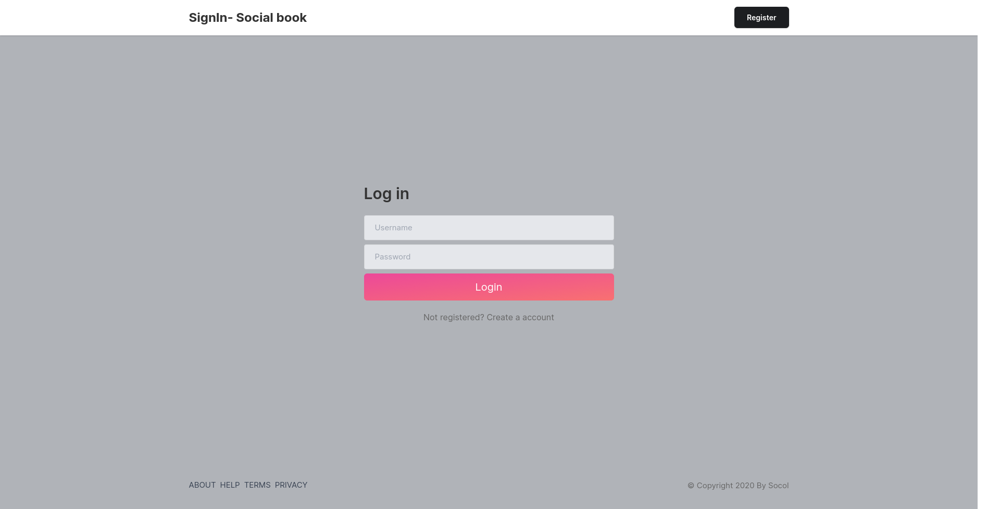
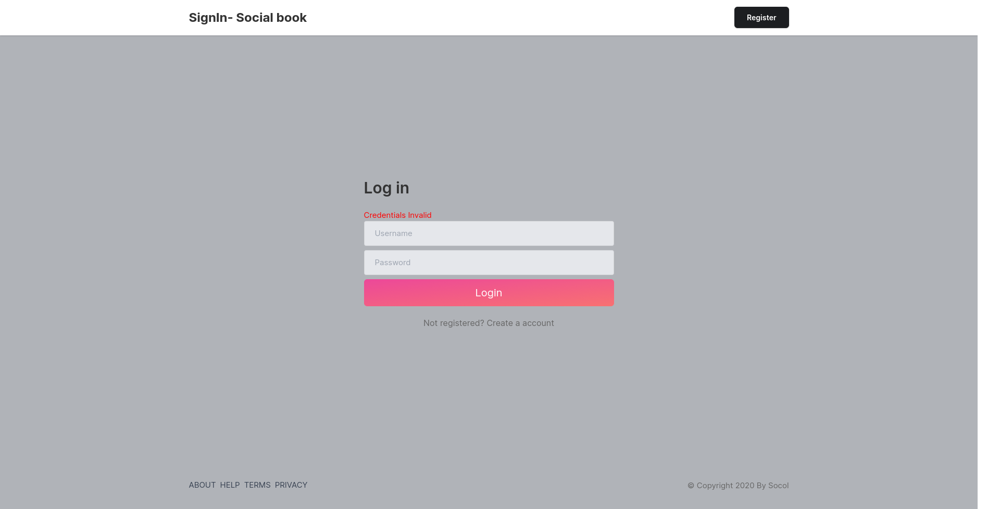

# social-media-clone

## Description
This is clone of social media like application using django and front-end technologies like html,css and js. Here I have completed the login page


## Setup and Installation
To install all project dependencies, run the following command:

```bash
pipenv install
```

## Activate the Environment

To activate the virtual environment, use the following command:

```bash
pipenv shell
```

## Running the Project
Navigate to the project directory:

```bash
cd social-book
```

To run the project, execute the following command:

```bash
pipenv run python3 manage.py runserver

```

## SignUpscreen view


##  Email validation


## Password validation


## Login page view



